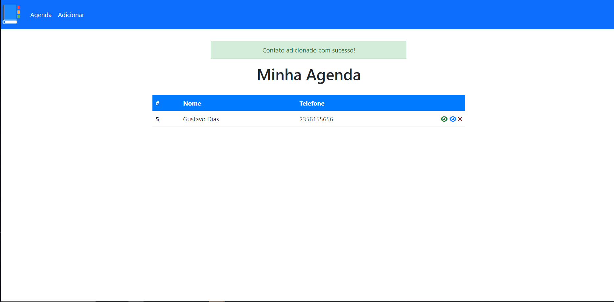
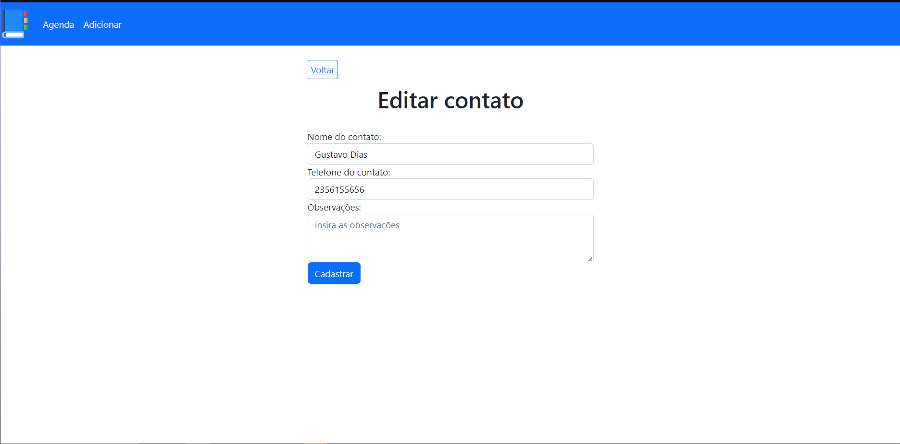
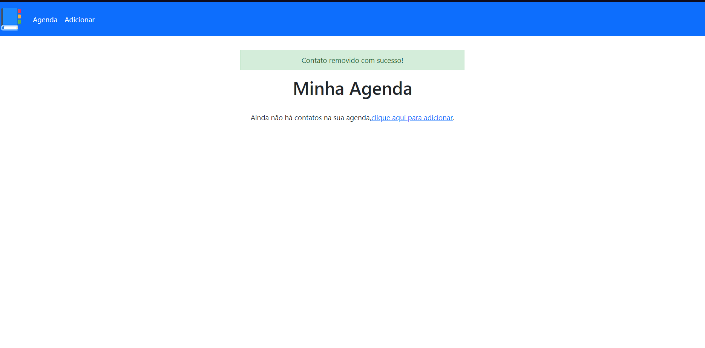

# Agenda PHP

Uma pequena agenda feita em php que realiza as funções basicas de um crud em php, criar , ler , alterar e deletar , a agenda esta conectada com um banco mysql e o ambiente usado para desenvolvimento foi o xampp.


## Demonstração







## Funcionalidades

- Criar registros
- Ler registros cadastrados
- Alterar registros cadastrados
- Deletar registros cadastrados


## Rodando localmente

Clone o projeto

```bash
  git clone https://link-para-o-projeto
```

Entre no diretório do projeto e instale o banco

```bash
  Execute o script agenda.sql em seu servidor sql local
```

Execute um ambiente de PHP + Mysql +apache

```bash
  Baixe e instale algum ambiente de wamp, lamp ou mamp
```

Inicie o servidor

```bash
  xampp control panel > apache start , mysql start
```

Abra o index

```bash
  na pasta do do seu ambiente va ate a pasta htdocs, htroot  
```
```bash
  cole a pasta do projeto
```

```bash
  abra o index no navegador e digite http://localhost/project-name/index.php
```